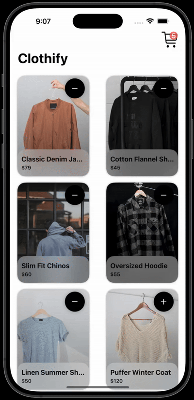

# Clothify 🛍️

A modern, animated e-commerce iOS app built with SwiftUI featuring smooth animations and reactive state management.

<div align="center">
  
</div>

## 🎯 Project Overview

Clothify is an iOS shopping application that demonstrates SwiftUI concepts including animations, reactive state management, and modern iOS design patterns. The app features a product catalog with a functional shopping cart system enhanced with smooth animations.

## ✨ Key Features

### 🎨 **Animations**
- **Cart Icon Animation**: Dynamic scale animations (0.7x to 1.2x) with spring physics
- **Smooth Transitions**: Items slide in/out with `.move(edge: .trailing)` transitions
- **Spring Animations**: Custom spring response and damping for natural feel
- **Real-time Feedback**: Visual feedback for all user interactions

### 🛒 **Shopping Cart System**
- **Add/Remove Items**: Seamless cart management with animated feedback
- **Live Total Calculation**: Real-time price updates using functional programming
- **Cart Badge**: Dynamic item count display with smooth scaling
- **Empty State Handling**: Elegant empty cart messaging

### 📱 **UI/UX Features**
- **Responsive Grid Layout**: Adaptive `LazyVGrid` with optimal spacing
- **Material Design**: Ultra-thin material backgrounds for depth
- **Shadow Effects**: Multi-layered shadows for visual hierarchy
- **Gradient Overlays**: Professional product image overlays

## 🏗️ Technical Architecture

### **MVVM Pattern**
```swift
// Reactive state management with @Published
class CartViewModel: ObservableObject {
    @Published var cartItems = [Product]()
    @Published var cartScale: CGFloat = 1.0
}
```

### **Animation System**
```swift
// Custom spring animations for natural feel
.animation(.spring(response: 0.3, dampingFraction: 0.4, blendDuration: 0.2), value: cartScale)
```

## 🛠️ Technologies & Frameworks

- **SwiftUI**: Modern declarative UI framework
- **Swift**: Latest Swift features and syntax
- **Xcode 15+**: Latest development tools and features

## 📁 Project Structure

```
Clothify/
├── App/
│   └── ClothifyApp.swift          # App entry point
├── Models/
│   └── Product.swift              # Data model
├── ViewModels/
│   └── CartViewModel.swift        # Business logic & state
├── Views/
│   ├── Main/
│   │   ├── HomeView.swift         # Product grid
│   │   └── CartView.swift         # Shopping cart
│   └── Components/
│       ├── ProductCard.swift      # Product display
│       ├── CartButton.swift       # Animated cart icon
│       └── ProductRow.swift       # Cart item row
├── Utils/
│   └── DeveloperPreview.swift     # Sample data
└── Assets/
    └── Product images & demo GIF
```

## 🚀 Getting Started

### Prerequisites
- Xcode 15.0 or later
- iOS 17.0+ deployment target

### Installation
1. Clone the repository:
   ```bash
   git clone https://github.com/m-rabbi/Clothify.git
   ```
2. Open `Clothify.xcodeproj` in Xcode
3. Select your target device/simulator
4. Build and run (⌘+R)

## 🎯 Skills Demonstrated

This project showcases:
- **SwiftUI Development**: Complex layouts and animations
- **Reactive Programming**: State management patterns
- **iOS Design Patterns**: MVVM architecture
- **Animation Design**: Professional-grade user feedback
- **Modern iOS Development**: Latest SwiftUI features

## 🤝 Contributing

This is a portfolio project showcasing SwiftUI development skills. For questions or feedback, please reach out via GitHub.

## 📄 License

This project is created for educational and portfolio purposes.

---

## 👨‍💻 Developer

**Md Rabbi**  
iOS Developer & SwiftUI Enthusiast  
GitHub: [@m-rabbi](https://github.com/m-rabbi)

*Built with ❤️ using SwiftUI*

